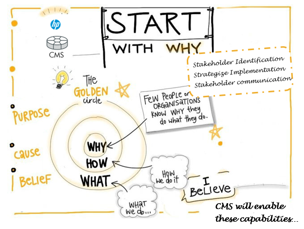

# About HP CMS Best Practice Reference
The Best Practice reference material is used in tandem with the HP uCMDB/Universal Discovery Product documentation.

## How to use this reference

HP uCMDB/UD has been adopted by many customers around the globe. There are no short-cuts to get the best value out of your CMS solution. Always start with the best design to get the best value out of CMS solution. Study suggests that you can avoid 30 to 40 percent of operational challenges by just giving more attention to the details of your CMS design and pre-planning your Integration points.

HP practitioners community & HP forums will help you to get on-board with the product. Experts around the world and HP Support will listen to you, if you are struck in a technical roadblock.

## Stakeholders change the game

(C) Copyright 2015 Hewlett-Packard Development Company, L.P.
