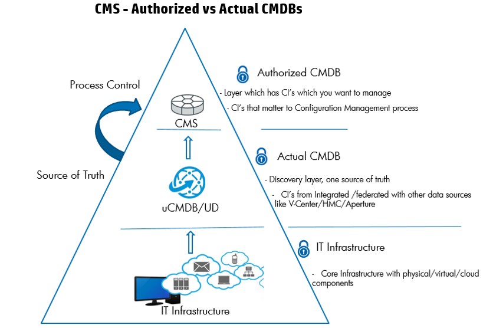

# CMS Architecture - Authorized CMS

Together with HP UCMDB Configuration Manager (UCMDB-CM) you can standardize your IT environments, and make sure they comply with clear policies, and defined authorization process.

Many IT organizations turn to a CMDB and configuration management processes to create a shared single version of truth to support business service management, IT service management, change management, and asset management initiatives. These initiatives help align IT efforts with business requirements and run IT operations more efficiently and effectively.

