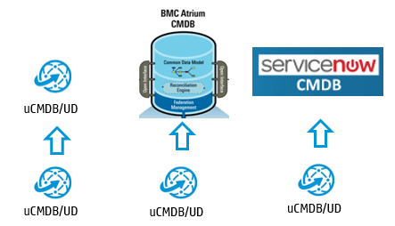

# CMS Architecture - Hybrid CMS

Understanding ITSM financial cost is very critical for the success of an organization. Hence, CMS products are designed to closely work with other 3rd party products in the market and provide customer with a plenty of options to architect and Implement our solutions.

It is quite common to have multiple CMDBs in a customer eco system. Every customer architecture Is different. Some prefers single vendor solutions whereas others have multiple vendors.

**uCMDB as CMS :** Works great !!! You can have a uCMDB as manager of manager where the CI’s Can be federated or populated via out of box integration adaptors.

**3rd Party CMDB as CMS :** Some customers does have an hybrid ITSM architecture. For example, They may use remedy for Service desk functions and might have the monitoring and discovery tools With HP footprint. In these cases, you can have Remedy CMDB (Atrium) as CMS and can use the Integration between uCMDB and Atrium to feed in only CIs which needed to be managed by Configuration management process.

