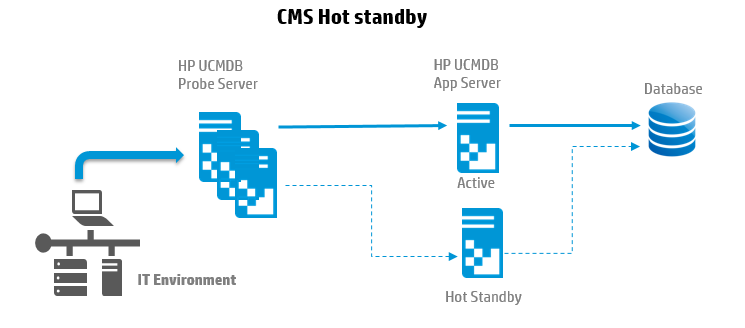

# CMS Architecture - Disaster Recovery

Hot standby configuration give you passive recovery on a disaster. It is extremely critical for the database to have a best recovery method. uCMDB application just need to connect to the database.

**Note :** Hot standby should be exactly same as the Application server version/CUP

## 3 step process for DR

SQL statements : update CUSTOMER_REGISTRATION set CLUSTER_ID=null; truncate table CLUSTER_SERVER; truncate table SERVER; truncate table CLUSTERS;

Connect hot standby server to Database by connection wizard.

Re Connect all the probes to hot standby server.

