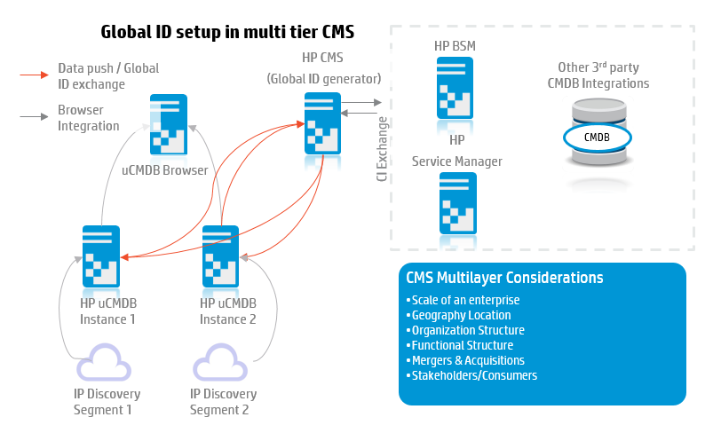

# CMS Architecture - Global ID Setup

It’s becoming a de facto standard to decouple the discovery UCMDB from the consumer UCMDB. For a larger organizations, it is always better idea to have multi layer uCMDB setup.

