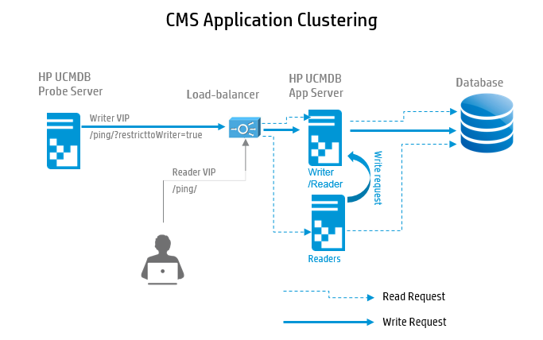
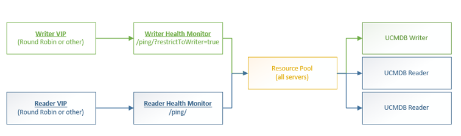

# CMS Architecture - High Availability

HP CMS support application clustering. Refer CMS sizing guide for performance numbers from RnD lab machines to understand how CMS solution perform in various configruations.

**Facts on HA - Application clustering model**

* External Access to UCMDB Servers via the load balancer, where two or more UCMDB Servers are configured.

* All of the UCMDB Servers are active at any given time & can handle both read and write requests.

* Requests are distributed to the UCMDB Servers in the cluster by the load balancer.

* All read requests are shared evenly among all of the UCMDB Servers (Readers), only one UCMDB Server (Writer)
is also responsible for write requests  at one time.

* Any write requests received by a Reader are passed to the Writer.

* Any of the UCMDB Servers can take over the Writer role in the case that the Writer becomes unavailable.

## Load balancer Requirements

* Cookie Insertion (in all responses to clients)

* Health Monitors

* (For SSL) Redirect Rewrites

## HA Logs

* cmdb.ha.log – short log. Displays info messages in short format. In case of exception only the message appears.

* cmdb.ha.detailed.log – also has exception stack trace. Has much more details in TRACE mode. For example: each HA request has request
ID, and we can follow the request’s trace between the servers.
