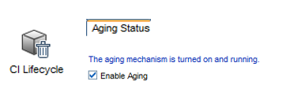
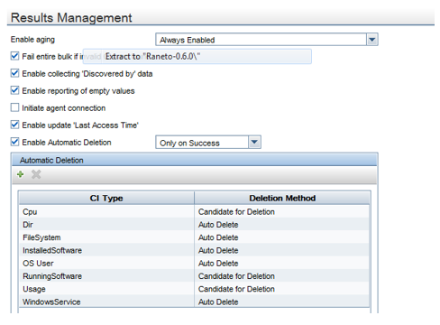
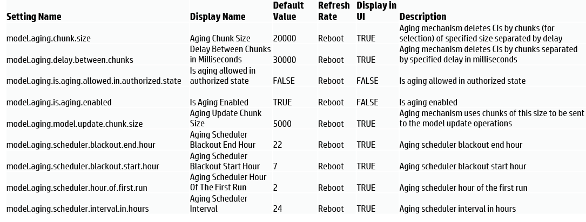

#Aging

Aging is a mechanism used to delete obsolete core UCMDB CIs and relationships. Unused Cis tax CMS performance. Every CI in the UCMDB consumes server CPU and memory, database resources.

Whenever the CI is touched by a discovery job, below properties are updated, so the deletion time is deferred.

# Aging setting @ adaptor level

You have full control on the setting up aging parameter for every CI types based on the discovery jobs. Adaptor settings will have a Results Management section which can guide you set appropriate aging setting for discovered CI Types.

DBTool: The DB Tool may be used for a mass deletion of aged CIs and relationships. It deletes the CIs in batch mode, and requires server shut down. It writes log messages to db.tool.log.
Usage: < UCMDBServer>\tools\dbscripts\dbtool.bat aging

# Aging Internal and External Fuse Settings

