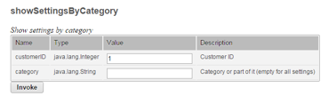
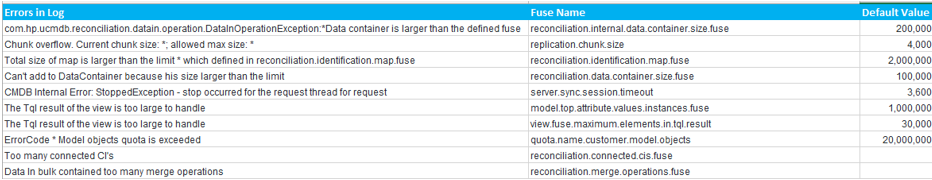

# Fuse Settings

Fuse Settings
Fuse & Quota settings works just like electric fuse which prevents excessive load or short circuit. With 10.20, there are close to 700+ settings available.

Log in to JMX Console & go to **UCMDB:service=Settings Services > Invoke**. This will show all the settings name, Current Value in your environments & default / factory values.

**Disclaimer :** HP fine tunes these settings in every CP and major releases. Increasing some of the settings without any cause will have negative Impact to the CMS performance. If you get Fuse / Quota Errors in the log, try to incrementally increase and fine tune your environment.

Lets look at some log patterns to look for in the uCMDB/UD server logs which can guide you to detect FUSE / Quota Errors.

* Adjust fuse settings only when you see these errors. Always analyze the logs and be cognizant on these settings.
* Always document the changes and validate the changes after every CUP upgrades.
