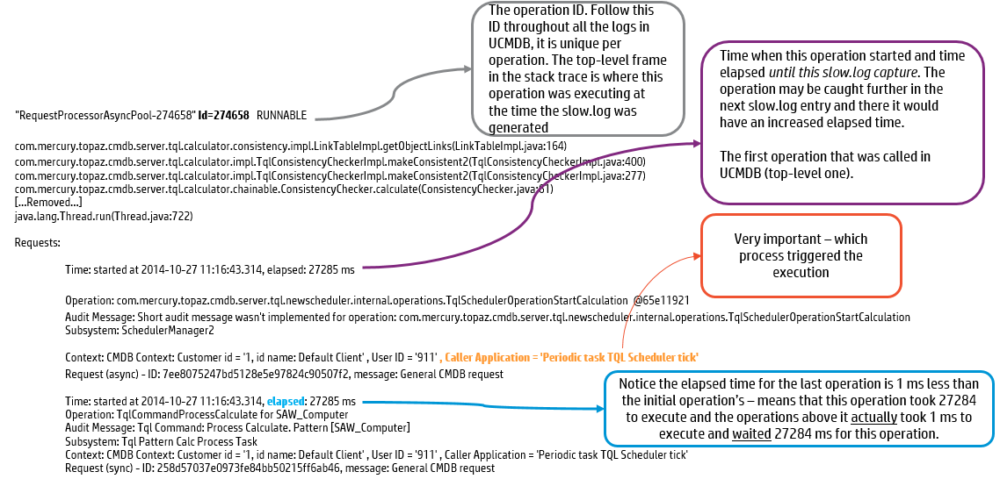
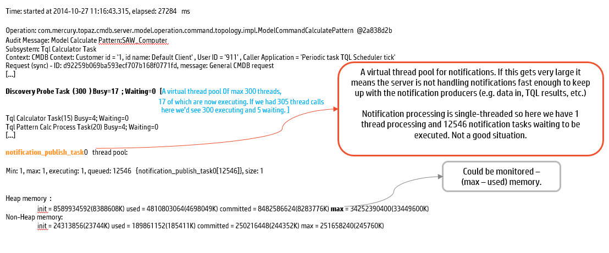

# Log file Analysis

uCMDB/UD Application Probe logs provide extensive insights on the application/discovery health. Utilities like baretail , baregrep will help to read uCMDB logs from windows servers.

Comm Log for discovery Jobs : Enabling Communication logs for debugging discovery job failures will help to troubleshoot. Enabling Communication logs will tax the system resources on the probe server. Enable comm logs only when you or HP support wants to debug the logs. Check job adaptor configuration settings.


**DEBUG :** Log levels in UCMDB are configurable by changing the log setting under the \conf\logs. No logs should ever be in DEBUG by default as it Affects the System IO performance. Enable the debug mode only when troubleshooting.

# Log file Analysis (patterns to look for)

**Wrong DB Credentials :** error.log, cmdb.dal.log

```
com.mercury.topaz.cmdb.server.manage.dal.CmdbDalException:
[ErrorCode [2] Couldn't connect to database ]:Error getting connection from pool Caused by: com.mercury.jdbc.sqlserverbase.ddd0: [mercury][SQLServer JDBC Driver][SQLServer] Login failed for user 'sa'.at com.mercury.jdbc.sqlserverbase.ddb9.b(Unknown Source)```


**Database Down :** error.log, cmdb.dal.log

```
Caused by: com.mercury.topaz.cmdb.shared.base.CmdbException: [ErrorCode [-2147483648] undefined error code] com.mercury.jdbc.sqlserverbase.ddd0: [mercury][SQLServer JDBC Driver] Error establishing socket to host and port: myd-vm02162:1433. Reason: Connection refused```


**DB Timeout : **error.log, cmdb.dal.log

```
Timeout expired. Check DDM logs to see what's taking so long java.sql.SQLTimeoutException:
[mercury][SQLServer JDBC Driver]Execution timeout expired java.sql.SQLTimeoutException:
[mercury][Oracle JDBC Driver]Execution timeout expired.```


**Server out of memory :** error.log , wrapper.log

.```
...... Dumping heap to java_pid7624.hprof ... java.lang.OutOfMemoryError : Java heap space
```

**Java heap out of memory :** wrapper.log

```
java.lang.OutOfMemoryError: GC overhead limit exceeded
java.lang.OutOfMemoryError: Java heap space```


**Failed to start server :** wrapper.log

```
...INFO  - Starting cmdb server
... FATAL  | wrapper  | 2014/09/22 15:31:21.322 | There were 10 failed launches in a row, each lasting less than 300 seconds.  Giving up```


**JVM Hung :** wrapper.log

```
...JVM appears hung: Timed out waiting for signal from JVM.
... ERROR  | wrapper  | 2014/08/28 11:11:55.417 | JVM did not exit on request, terminated```


# Slow.log Dissected






