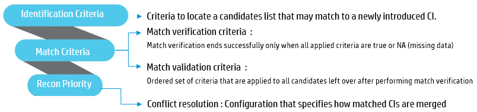
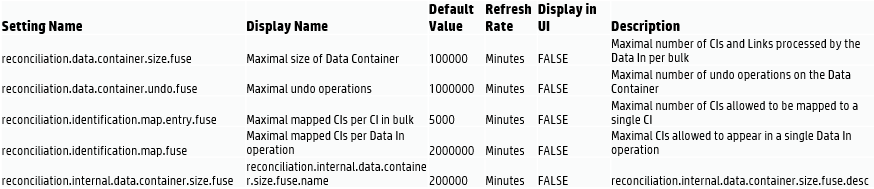

# Reconciliation
Reconciliation is the process of identifying and matching entities from different data repositories. Reconciliation engine is responsible for identifying and matching entities from different data collectors and storing them, without duplicating CIs in UCMDB.




**Reconciliation Priority :** HP CMS solution is flexible in Integrating with other ITSM products. HP recommends to use Reconciliation Priority to Identify the Source of truth for a CI. Once you have an Integration Point established, Reconciliation priority should be Immediately set. .

**Logs to watch for Recon issues:**
```
cmdb.reconciliation.audit.log
cmdb.reconciliation.log
cmdb.reconciliation.datain.ignored.log
Recon Internal and External Fuse Settings:```

**Recon Internal and External Fuse Settings:**

