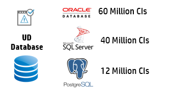

CMS Implementation - Database
Database responsiveness is critical for the CMS application. CMS is a typical OLTP application where it demand good read/write from responsive DB. It is good practice for the Database admin to identify workloads and plan the DB online maintenance scripts.

Lets assume a scenario where a db insert query is slow and you would like to understand the DB bottleneck. First identify if it is an infrastructure issue ( CPU/MEM bottleneck, IO bottleneck ..). If not you need to look for DB performance bottle neck items like...

Temp db bottlenecks
Transaction log bottlenecks deadlocks
Indexing issues.
Always use the database requirement guide as a validator to check if you have the database server setup properly. Before CMS server goes for production, make sure the DB Admin has monitoring enabled and is capturing all required metrics for effective Analysis. If you have products like HP OM Agent with Oracle SPI, the agent will have some OOTB policies to capture the DB metrics which can then be visualized via HP Performance Manager.

If you have oracle installed on unix machine which has OV Performance Agent, then you can customize the parm (/var/opt/perf/parm) file to get oracle related process information.

## Database # CI support

