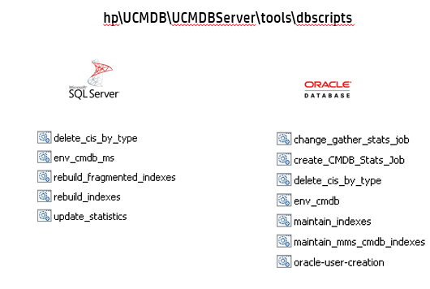

# Database Tools / Scripts



## Database - Tips

* Do not place data or log files on the same disk.

* Recommended to use a fault tolerant disk ideally, RAID 1. RAID 0+1 is recommended for database files because it avoids hot spots. If RAID 0 does not provide protection against failures. It requires a strong backup strategy.

* Data File Properties (SQL Server): File growth ~30-100 MB ; Recovery Model : Full

* Temp DB : (SQL Server)

* * 1 GB with a growth increment of 50 MB. Striped across several disks, ideally on a RAID 0+1 controller

* * Min 20 GB space on disk where temp DB is located.

* Oracle - UCMDB does not support Oracle 12c with CDB

* For both the databases, apply latest database patches.

* For more detailed configurations, check the respective database configuration guide.

* Do no enable the execution of statistic against the temp tables of the schema.

* DB Connection pool defaults.
```
#maxPoolSize=100
#minPoolSize=2
#maxWaitForConnectionSec=10```


* cmdb.conf  To view Connection Settings to database.
