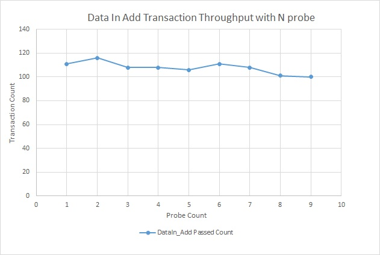

# Data-in Max Throughput

Sending the Required CIs to DataIn
The resulting CIs and relationships are collected in a temporary cache, and then sent to DataIn for execution every time this cache reaches a predefined threshold. This threshold is set to **20,000 CIs/relationships **and can be reduced using the parameter

enrichment.model.changes.chunk.size. Note: this value cannot be increased to more than 20,000 due to DataIn limitations.
Each bulk of the resulting CIs and relationships is sent to DataIn in the following order:
* CIs to be created
* CIs to be updated
* CIs to be deleted
* Relationships to be created
* Relationships to be updated
* Relationships to be deleted

The order defines the expected outcome in cases where there is more than one ac- tion for a specific CI. Note: CIs and relationships that are connected to each other are always sent to DataIn in the same bulk.

The execution of DataIn operation is performed asynchronically. As DataIn is single-threaded, usually the enrichment finishes its execution while bulks of the resulting CIs are still handled or in the queue in DataIn. To understand when the current enrichment flow completed, view the reconciliation logs. Due to the asyn- chronic mode, if an error occurs while handling DataIn bulk, you do not receive any on screen information, though it is in the reconciliation logs.

# Topology Update Service

This service allows adding CIs and relationships to the UCMDB. When using this API, one should also be familiar with the identification rules in the system and make sure to send all of the identification data (attributes/related CIs) in the same bulk (TopologyModificationData).

**Performance tips:**

* The service supports bulk operations and you should add as many CIs and re- lationships as possible in each bulk, up to 20K CIs and relationships.
* The service is single threaded, so it won’t help to send many bulks in parallel. **It is recommended to send 2-3 bulks in parallel** – this will allow all processing to be performed in parallel.
* It is possible to update/remove a CI from the CMDB with only its ID (with no other identification data). Note: You should not create a CI with a real ID.

