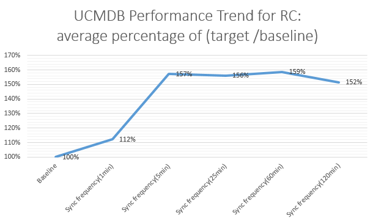

# Service Manager and RC Intergration with UCMDB

From series of lab performance testing, we find only RC integration will obviously affect UCMDB server performance. However, with RC integration enabled, UCMDB server and DB server’s CPU usage is healthy, and their memory usage is a healthy status.

That means most of UCMDB server and DB server’s resource not in use. For RC integration, once RC sync workload near UCMDB’s throughput (about 480 changes/hour), the UCMDB server’s performance will seriously down about 30%-50%.

* For Service Manager Push and population workload, about 5% performance down with 800K CI/hour workload

* For RC integration, UCMDB server is very sensitive. With 1,000 changes/hour workload, performance will down 50%.

* For RC integration, UCMDB’s throughput is about 480 (this number was based on 10.01, will verify it on 10.20 later)
changes/hour with single-thread mode. It means if there is 480*N changes will take about N hours in UCMDB side.

* For RC integration, under less than UCMDB’s throughput (about 480 changes/hour), the UCMDB server’s performance
will down about 5%.

* For RC integration, once RC sync workload near UCMDB’s throughput (about 480 changes/hour), the UCMDB server’s
performance will seriously down about 30%-50%.

**Adjust RC sync frequency with UCMDB:**

* It is better to set 1 min (this number was based on 10.01, will verify it on 10.20 later) for RC sync frequency
with UCMDB in RC settings.

* Monitor RC sync average speed/throughput (the value is almost a constant, how many changes are operated every minute?)
Once the input of RC Changes near UCMDB’s throughput, the UCMDB performance will seriously down about 30%-50% and
you will get poor performance experience.

