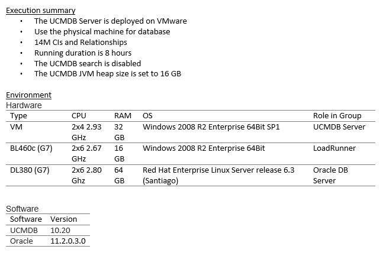
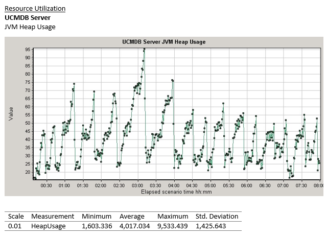

# Performance Benchmark test scenarios
For the performance benchmark testing, we will populate some data for the test. The population is created using UCMDB java API and is run via LR java protocol. UCMDB consists of CIs and links between those CIs. For our basic system test population, we create around 14 million CIs and links that consists of the following topology:

The above topology is created 701 times (For 14 million CI population) and is differentiated with different subnets (See ipSubnet “root” at the top of the of the above topology illustration). Apart from the different ipSubnet, we also mark each million CI with a number, we use this number in our system test which will be explained later.

**Testing scenarios : **The UCMDB system benchmark testing lasts 8 hours including

* **Data-in:** "1 data-in user". Each data-in user performs insert of bulk of 10K CIs 1 time, then update of those 10K CIs 3 times and then delete of 10K CIs.

* **Enrichment:** "1 enrichment user". Each enrichment user performs insert-update-delete of 3K CIs, in the interval of each operation is 15 minutes.

* **TQL calculation:** "13 TQL users". Each user calculates 10 TQLs in interval of 100 seconds and then saves and deletes TQLs each 30 seconds.

* **View: **"6 view users". Each user saves and deletes views each 30 seconds, gets all views each 1 minute.

# Benchmark test results

uCMDB 10.20 Benchmark Test –14M benchmark test on physical (Search disabled)

Execution summary

* The test was based on physical machine.
* 14M CIs and Relationships
* Running duration is 8 hours
* UCMDB search is disabled
* uCMDB JVM heap size is set to 16 GB

