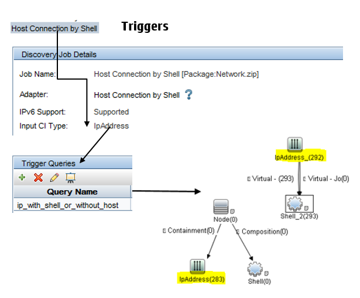

# Discovery Use Cases

* Data Center Transformations (migrate/consolidation/etc.)
* IT Asset/Inventory Management (UD Agent - Inventory Scan)
* Audit / Compliance (Security, running process/sw, registry keys..)
* Change Management (CI Impact analysis)
* Closed-Loop Incident/Problem management (layer 2, TBEC)
* Service Modelling (Dependency, Application mapping)
* Configuration Management(CI state management )

# Discovery Jobs - Triggers

Before enabling discovery jobs, read the CP documentation To understand the adaptor design. Always test the job with a **small trigger**. Validate the topology Results and the attribute data quality before enabling the job For rest.

Always look for the **trigger counts**. You will see performance Issues on the probe end when the triggers goes up more than **40k triggers**. This is again subjective and truly based on the probe performance and business of probe while running the Job.

Before enabling any jobs, always study the input trigger and discovery triggers. If a job has more than 40k triggers, you can always **split the job** and have two different triggers. By this way you have the flexibility to **schedule at different intervals**.

