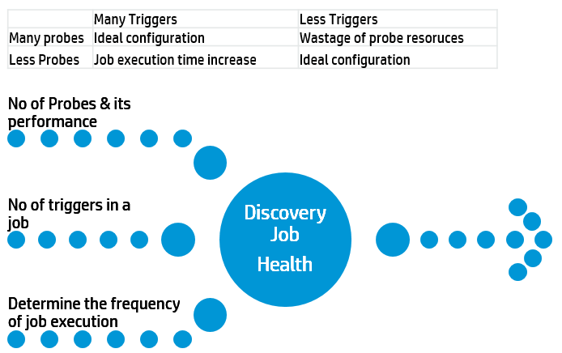
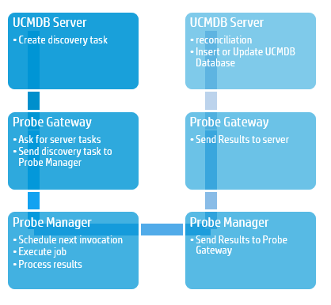
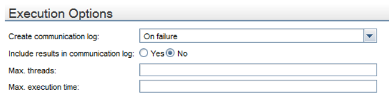

# Discovery Job Performance

**Scheduling Discovery Jobs:** There are several factors to consider before activating the discovery jobs. You have to carefully take a decision based on probe sizing which depends on frequency at which you want to run discovery jobs.

# Discovery Jobs - Scheduling

**Discovery scheduler**
- Enables the user to define a schedule for a specific job.
- Defines invocation time and frequency of the discovery (daily, monthly)

**Time Template**
Defines when the job should run.

**Invoke on new Trigger CIs immediately**
A check mark signifies that the job runs as soon as the Trigger CI reaches the Probe. If this column does not contain a check mark, the job runs according to the schedule defined in the Schedule Manager.

# Discovery Jobs - Execution Options

Each job runs with multiple threads.

**Max Threads**
- You can define a maximum number of threads that can be used concurrently when running a job.
- If you leave maximum number empty, the Probe's default threading value is used (8). The default threading value can be set in probe’s configuration file

**Max Execution Time**
The maximum time allowed for a pattern to run on one Trigger CI. Probe check for threads that run longer than allowed, and when the number of such threads pass the acceptable amount (set in properties file), the probe restart itself.

**Adaptor Settings**
All the configuration descried on last slide can be set for each discovery pattern, on Pattern Management tab.

