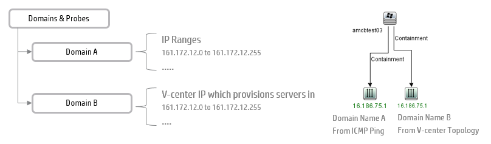
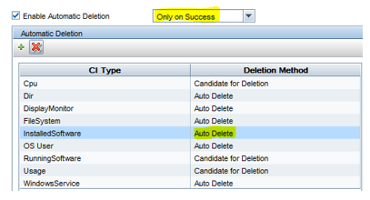
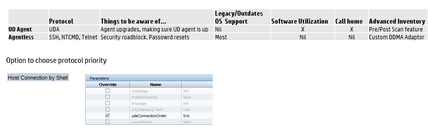

# Discovery Job - Domain Overlap

**IP Range overlap in domains:** IP Range duplicates are allowed in different domains. Be cognizant about adding same IP ranges to multiple domains as the Identification rule for IP Address include domain name in the ID criteria, hence there is a strong possibility of creating duplicate IP Addresses.

Also jobs like HMC, Vcenter connections should be managed efficiently in the respective domains. If you have a Vcetner which provisions servers in different domains, you may end up with dups on IP Address layer.

Discovery Job - Aging Settings
Software IT Asset management always look for fresh data from the discovery scan.
You can set the aging setting per CI Type on the adaptor level to get ever green data.

- Right click on the Inventory Discovery by Scanner > Go to Adaptor.
- Click Adaptor Configuration
- Select Only on Success and validate if Installed Software has Auto Delete option enabled

# Agent vs Agentless

