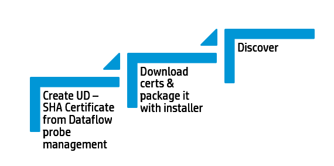

# UD AgentUD

****
Agent Install: UD Agent package available for most of the OS flavours. It is extremely important to understand the options you have with the agent Installer before you package them via software distribution systems or automation tools.

Discovery Job – Call home processing
Call Home provides a way for discovery nodes to communicate with the Data Flow Probe. Based on your enterprise size, network latency and the dynamics, you need to set the appropriate call home setting on the agents. Once it is set, agent tries to send a call home to the probe IP configured which creates a Call Home Event CI on a server.

This trigger is then processed by call home processing job. You can also look at the global setting To tweak the right time interval to fit your enterprise needs.

Global Setting :
Discovery

Server Cloning with UD Agents
With Increasing dependencies in cloud and Virtualization, cloning a server with a server image is very common in the Industry. If UD agents are installed in your image, make sure you create a new UD Unique ID from below commands from post Install scripts.

ud_unique_id is used a critical differentiator in Identification and validation rules. Chances Of merging 2 servers with same UD Agent ID becomes higher.

Windows: 	discagnt.exe --newuniqueid

UNIX: 	discagnt --newuniqueid

Discovery

Leverage scope, UD Certs
Create a discovery account for agentless discovery. Having a single account helps to simplify discovery job execution.

If you add multiple entries, you can use scope to limit the credential scope to a specific network segment.

Job Timeouts will have an direct impact when you have multiple credentials for network scope (ALL)

Creat If you UD agent deployed in workstation and server environments & you want to discover them in 2 separate instances, you can Use different UD certificates to distinguish these environments.

Discovery
