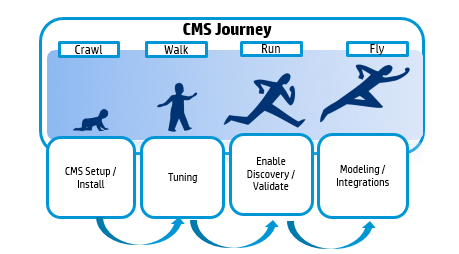

# CMS Maturity Model
Before working on a CMS solution, know your customer and identify the critical data needs. CMS (uCMDB/ UD) data quality is critical for successful Implementation. Validating end to end discovery helps to gauge the KPIs on the discovery data.

Define your Internal roadmap on CMS Implementation, data discovery, service modelling, training internal stakeholders & so on. Access your organization’s CMS process maturity with
**Crawl – Walk – Run – Fly maturity model.**

