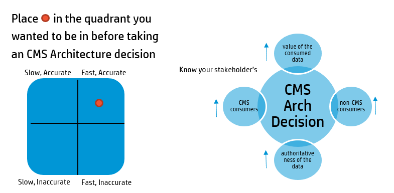

#Select your quadrant ( Scalable Architecture)
CMS (uCMDB/ UD) Solutions are scalable. Good Implementation needs stable architecture. Identifying bottleneck is real science ! This is your starting point to perfectly design a solution. Lets assume a scenario where a customer bought CMS solution and trying to setup CMS. There are several Items needed to be considered before going to a drawing board.

